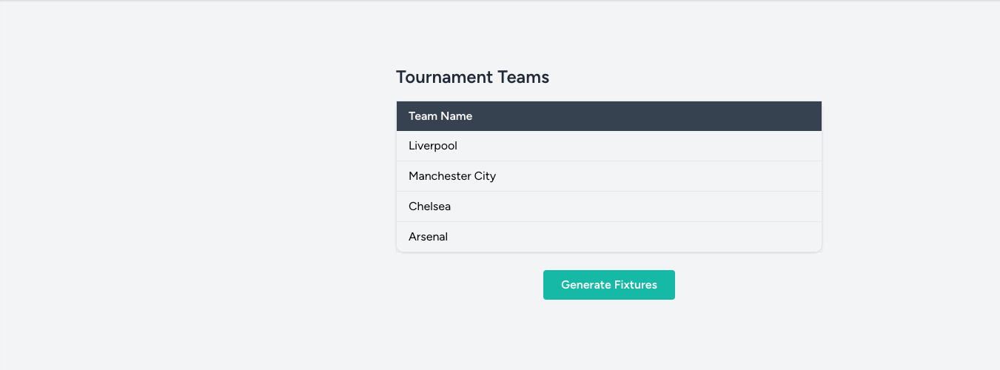
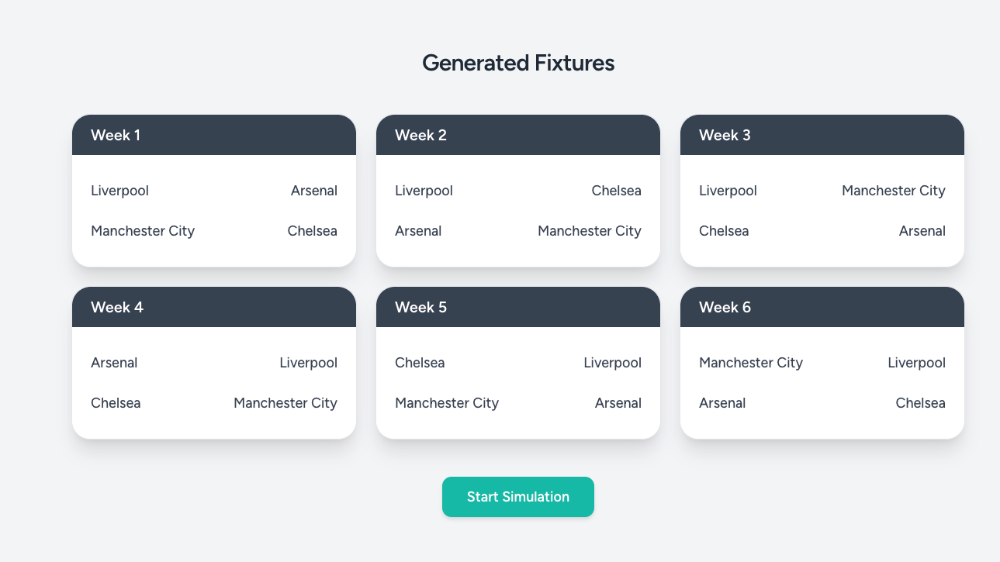
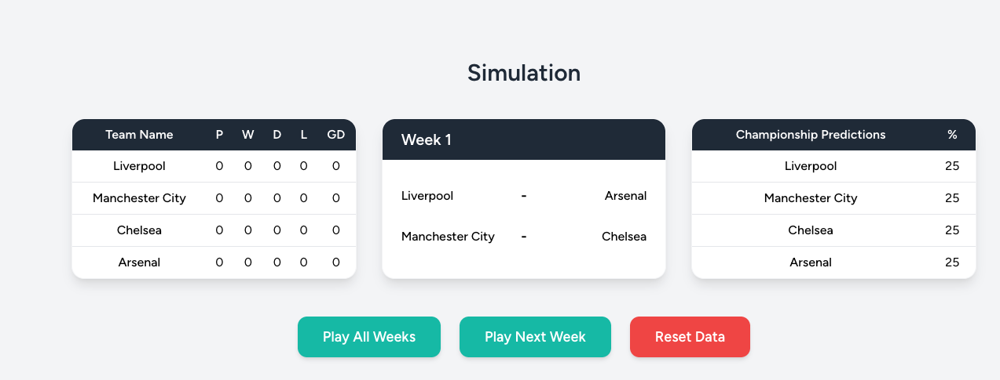

This project was developed with Laravel and Vue (InertiaJs). It is a small league simulation application.

Commands required to run the project after cloning.

- Copy .env.example as .env

- composer install
- npm install
- php artisan migrate:fresh
- php artisan db:seed

For running projects:
- php artisan serve
- npm run dev

For login, you can use admin@test.com, it's password is password.

